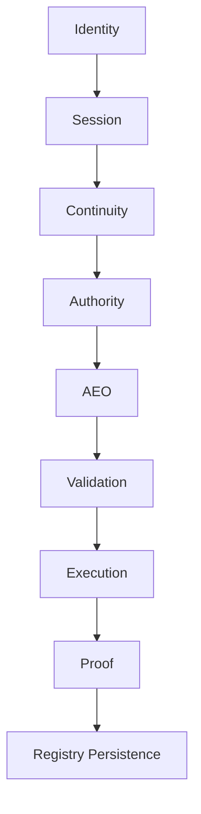
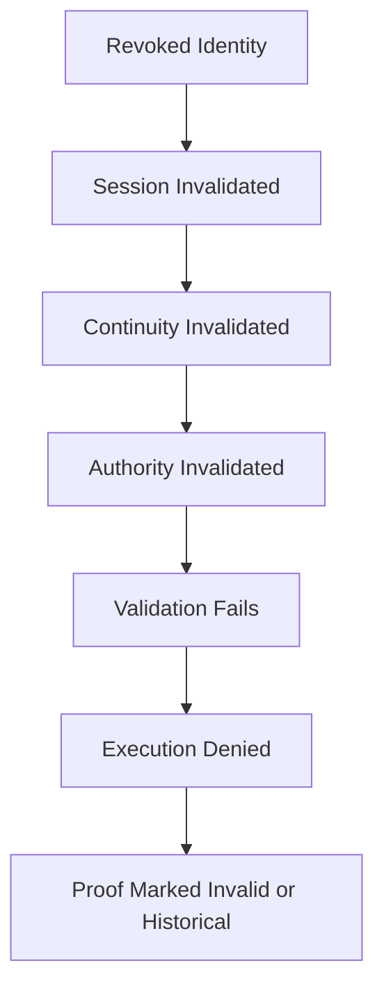

# Continuity Threat Mapping

## Purpose

Map continuity, replay, revocation, identity, authority, and proof-lineage threat classes across the MindShift legitimacy chain.

This artifact is non-operative.

It does not:
- create authority
- validate objects
- execute actions
- mutate runtime state
- generate proof
- alter replay semantics

Canonical continuity invariant:

```text
No valid identity/session continuity chain
→ no valid authority
→ no valid execution.
```

---

## 1. Legitimacy Continuity Chain



### Continuity Rule

Every downstream legitimacy layer depends on upstream continuity integrity.

If continuity collapses:

```text
authority collapses
→ execution legitimacy collapses
```

---

## 2. Orphan-Authority Threat Matrix

| Threat Class | Description | Failure Condition | Required NULL Behavior |
|---|---|---|---|
| Expired Session Authority | authority survives expired session | stale authority lineage | authority invalidated |
| Detached Continuity Chain | continuity reference missing | orphan lineage | validation denied |
| Revoked Identity Persistence | revoked identity retains active authority | revocation propagation failure | execution denied |
| Detached Proof Lineage | proof persists after legitimacy invalidation | proof/continuity divergence | proof marked incomplete or invalid |
| Cross-Context Authority Reuse | authority reused in different continuity context | continuity mismatch | validation denied |

---

## 3. Replay / Continuity Threat Matrix

| Threat Class | Replay Vector | Failure Condition | Required NULL Behavior |
|---|---|---|---|
| Nonce Replay | reused invocation nonce | replayed legitimacy object | validation denied |
| Cross-Session Replay | replay across sessions | continuity mismatch | execution denied |
| Cross-Identity Replay | replay under different identity | identity lineage divergence | authority invalidated |
| Proof Resurrection | stale proof reused as active legitimacy | proof replay | proof invalid |
| Federation Replay | remote lineage replay | equivalence mismatch | reconciliation reports NULL |

---

## 4. Revocation Propagation Map



### Revocation Rule

Revocation must propagate downward.

No downstream layer may retain active legitimacy after upstream continuity invalidation.

---

## 5. Continuity Failure Modes

| Failure Mode | Structural Risk | Governance Impact |
|---|---|---|
| orphaned authority | detached execution capability | legitimacy bypass |
| replay without continuity validation | stale legitimacy resurrection | replay compromise |
| proof detached from lineage | unverifiable execution history | provenance collapse |
| reconciliation ignores continuity | false legitimacy equivalence | federation drift |
| agent coordination bypasses continuity | hidden execution delegation | governance collapse |

---

## 6. Continuity Audit Agent Boundaries

Continuity audit agents may:
- inspect lineage
- classify drift
- detect orphan state
- detect replay vectors
- produce continuity reports

Continuity audit agents may not:
- invalidate runtime state directly
- revoke authority directly
- generate proof
- authorize execution

Canonical invariant:

```text
observation ≠ authority
```

---

## 7. Future FATE Expansion Targets

Potential future FATE coverage:
- orphan-authority rejection tests
- revocation cascade tests
- replay across continuity contexts
- proof invalidation propagation
- federation continuity mismatch tests
- detached lineage detection tests

These are planning references only.

No runtime behavior is introduced by this document.

---

## Final Principle

```text
continuity
is legitimacy persistence

not session memory
```
