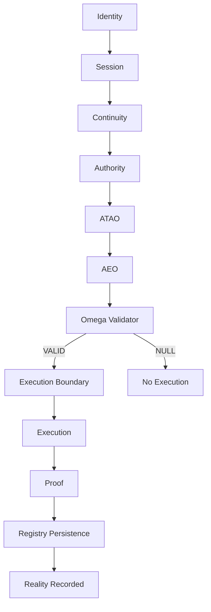
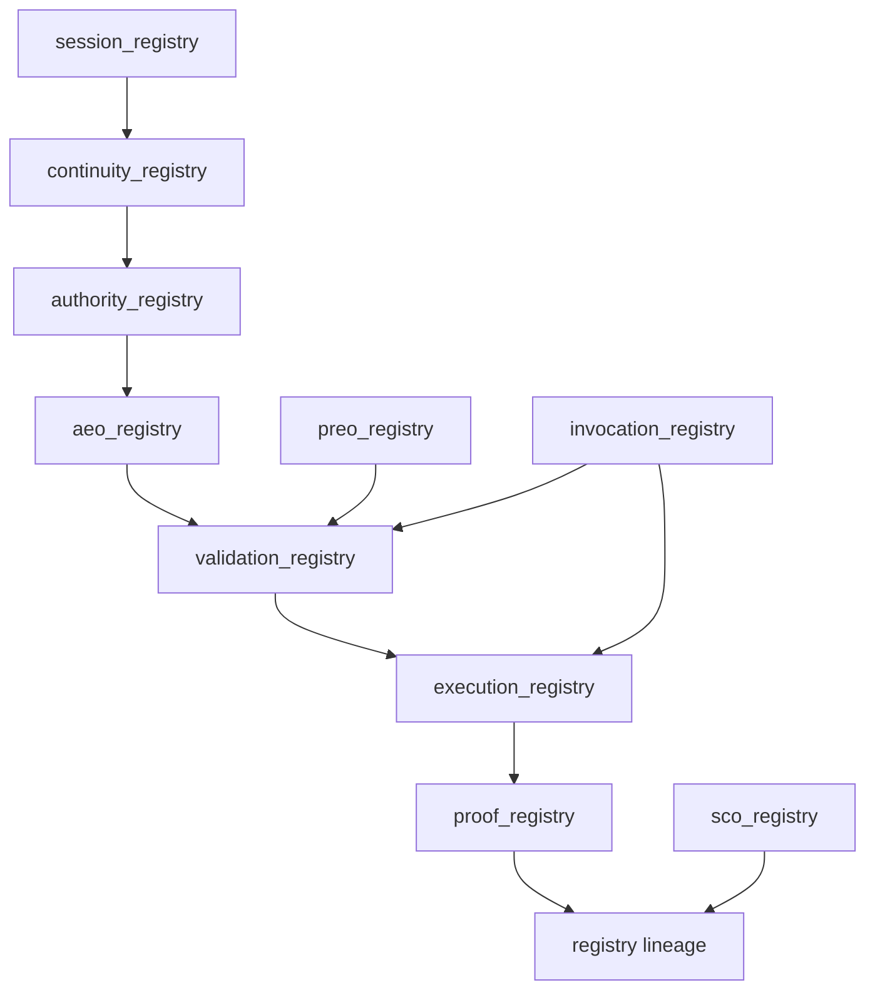
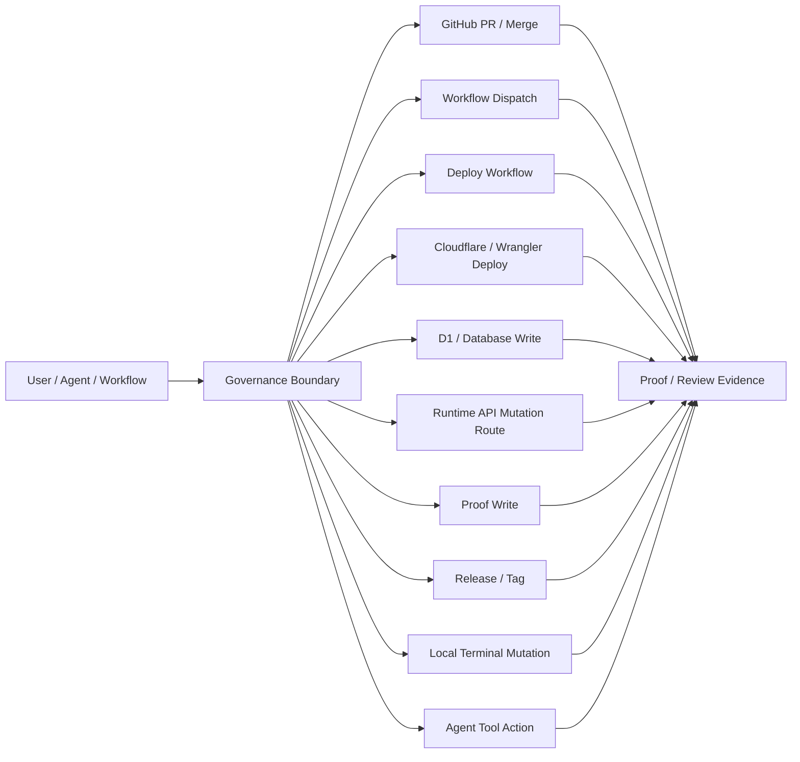
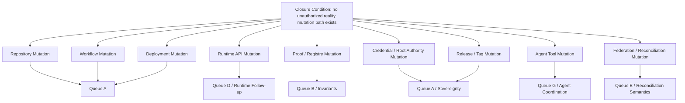
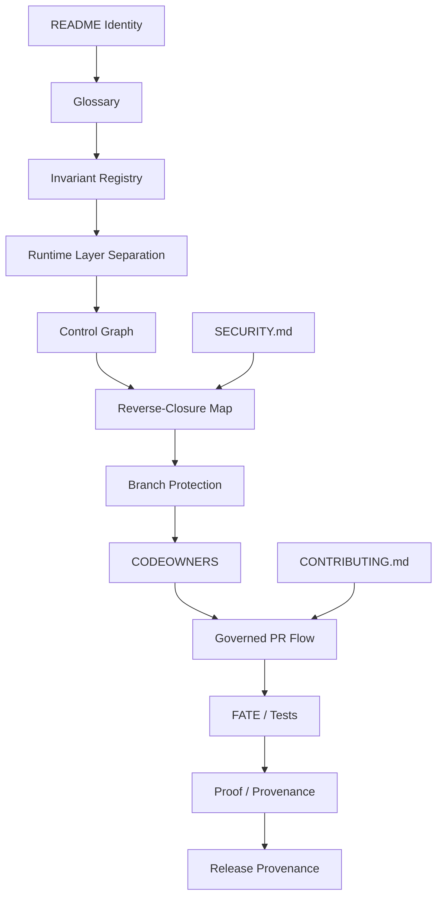

# Control Graph Visualization Artifacts

## Purpose

This document defines the first non-operative Control Graph visualization artifacts for MindShift legitimacy topology.

The Control Graph represents legitimacy lineage, registry relationships, execution surfaces, closure gaps, and governance dependencies.

It observes and describes legitimacy topology.

It does not create legitimacy.

---

## Non-Operative Boundary Layer

These diagrams may:

- describe topology
- classify surfaces
- show lineage
- expose closure gaps
- support review and governance planning

These diagrams must not:

- create authority
- validate objects
- execute actions
- generate proof
- mutate runtime state
- alter replay semantics
- alter reconciliation semantics

Canonical invariant:

```text
If no valid object exists → nothing happens.
```

Visualization invariant:

```text
representation ≠ authorization
```

---

## 1. Canonical Runtime Topology Diagram



### Interpretation

The runtime path is valid only when identity, continuity, authority, exact-object validation, execution boundary, proof, and registry persistence remain linked.

---

## 2. Registry Lineage Map



### Traversal Rule

```text
session
→ continuity
→ authority
→ AEO
→ validation
→ execution
→ proof
```

If lineage breaks at any point, downstream legitimacy collapses to NULL or incomplete state according to the relevant invariant.

---

## 3. Execution Surface Map



### Closure Question

Every execution surface must answer:

```text
what valid object authorizes this mutation?
```

If no valid object exists, the surface is a bypass risk.

---

## 4. Reverse-Closure Overlay



### Reverse-Closure Rule

Start from final closure condition and work backward.

Do not add features until the mutation surface is classified.

---

## 5. Governance Dependency Graph



### Dependency Rule

Governance artifacts depend on stable invariants and terminology.

Topology should not outrun semantics.

---

## Control Graph Closure Statement

The first Control Graph artifact is complete when topology can represent:

- canonical runtime chain
- registry lineage
- execution surfaces
- reverse-closure gaps
- governance dependencies

without introducing any new execution authority.
